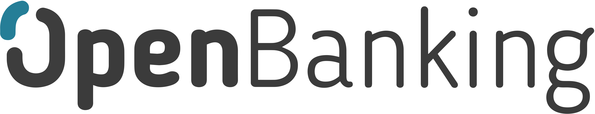

[Read this page in English](en-us/README.md)

# HUB Openbanking OS (Documentações, informações & API endpoints) 
O Objetivo deste repositório é centralizar as informações de API para facilitar a vida dos desenvolvedores em sua busca pela informação de endpoints.

De um dev para outro.

Lembrando que estamos em construção e provavelmente não teremos todos endpoints ainda, por isso é de mega importância a contribuição da comunidade :construction_worker:

## Documentação oficial do Open Banking Brasil
[Open Banking Brasil](https://openbankingbrasil.org.br/?cookie=true)

## APIs para desenvolvedores das companias
|  | Nome |  API desenvolvedores
| ------ | ------ | ----- |
|  | Banco do Brasil | [Developers API](https://apoio.developers.bb.com.br/referency)
|  | Banrisul | [Developers API](https://developers.banrisul.com.br/pages/allApis.html#openbanking)
|  | Bradesco | [Developers API](https://developers.bradesco.com.br/)
|  | Caixa | [Developers API](https://desenvolvedores.caixa.gov.br/api-catalog)
|  | Itaú | [Developers API](https://developer.itau.com.br/api-catalog/openbanking)
|  | Santander | [Developers API](https://www.santander.pt/open-banking/developers#)

## Endpoints
Aqui você irá encontrar os endpoints da instituições financeiras referentes ao openbanking.

### Produtos e serviços

#### Empréstimos pessoais
|  | Empréstimos pessoais link
| ------ | ------ | 
|  | [link to json](https://opendata.api.bb.com.br/open-banking/products-services/v1/personal-loans)
|  | [link to json](https://openbanking.banrisul.com.br/open-banking/products-services/v1/personal-loans)
|  | [link to json](https://api.bradesco.com/bradesco/open-banking/products-services/v1/personal-loans)
|  | [empty](empty)
|  | [link to json](https://api.itau/open-banking/products-services/v1/personal-loans)
|  | [empty](empty)

## Contribution
Para melhorarmos a informação gostaria de contar com a contribuição da comunidade, assim podemos criar um ambiente onde irá facilitar o nosso dia-a-dia como desenvolvedores e irá estimular a disseminação do conhecimento. Sinta-se livre para contribuir e ajudar, é isso que mantêm nossa comunidade em crescimento!

## Licença
MIT 
