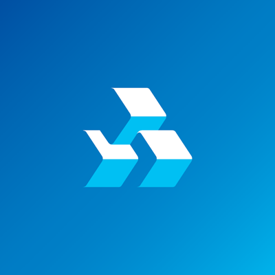

[Read this page in Portuguese](../README.md)
# Openbanking HUB OS (Docs, information & API endpoints)
Objective of this project is make easier endpoint search about Open Banking in Brazil. 

From a dev to another.

## Oficial doc from OpenBanking Brazil
[Open Banking Brasil](https://openbanking-brasil.github.io/areadesenvolvedor/)

## Developers API companies
|  | Name |  Developers API
| ------ | ------ | ----- |
|  | Banco do Brasil | [Developers API](https://apoio.developers.bb.com.br/referency)
|  | Banrisul | [Developers API](https://developers.banrisul.com.br/pages/allApis.html#openbanking)
|  | Bradesco | [Developers API](https://developers.bradesco.com.br/)
|  | Caixa | [Developers API](https://desenvolvedores.caixa.gov.br/api-catalog)
|  | Itaú | [Developers API](https://developer.itau.com.br/api-catalog/openbanking)
|  | Santander | [Developers API](https://www.santander.pt/open-banking/developers#)

## Endpoints
Here you're find endpoints api of banks and financial companies, I'd like the help of all the comunity and I'll be very thankful with your contribution, to keep this repository updated.

### Products services

#### Personal Loan
|  | Personal loan 
| ------ | ------ | 
|  | [link to json](https://opendata.api.bb.com.br/open-banking/products-services/v1/personal-loans)
|  | [link to json](https://openbanking.banrisul.com.br/open-banking/products-services/v1/personal-loans)
|  | [link to json](https://api.bradesco.com/bradesco/open-banking/products-services/v1/personal-loans)
|  | [empty](empty)
|  | [link to json](https://api.itau/open-banking/products-services/v1/personal-loans)
|  | [empty](empty)

## Contribution
Feel free to contribute and help. 

## License
MIT 

